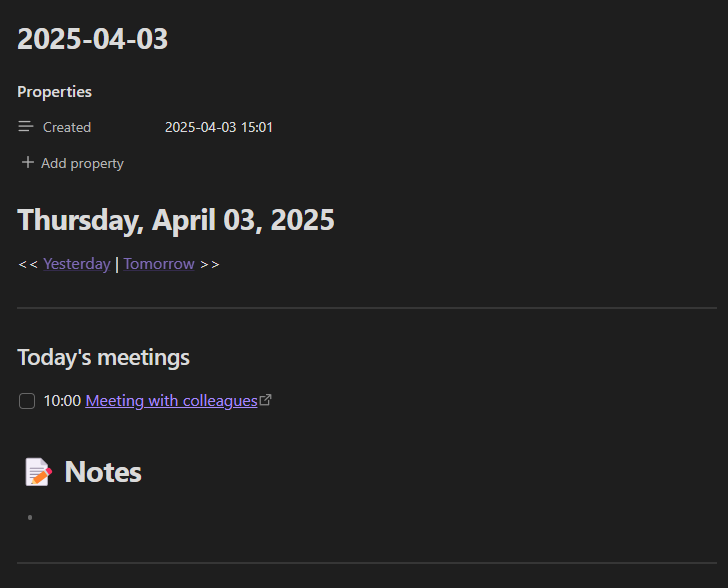
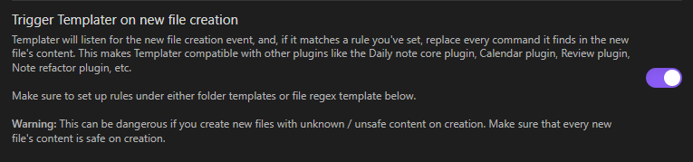
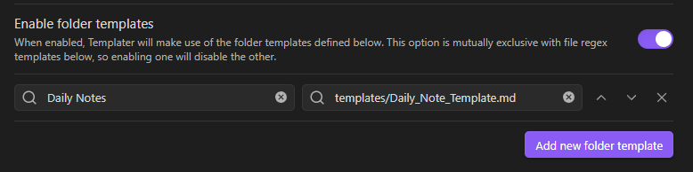
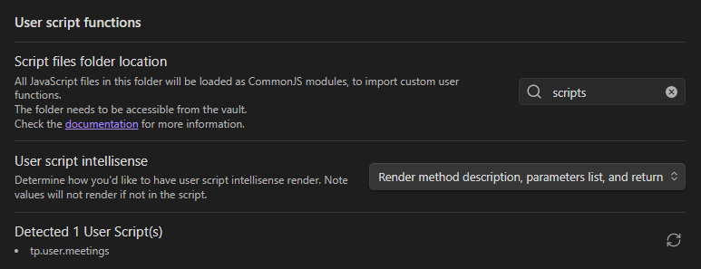

# Daily meetings in your daily notes!

With this template, you can easily create checkboxes with your daily meetings, even autogenerated links to it!


## Required plugins

- [Templater](https://github.com/SilentVoid13/Templater)
- [Dataview](https://github.com/blacksmithgu/obsidian-dataview) (optional)

## Setup

1. Download all plugins and enable it

2. Enable **"Trigger Templater on new file creation"**


3. Also choose the folder with your template and where it needs to trigger it.


4. You need to enable scripts to work with it. To do it, you need to specify your script folder and refresh your scripts to see that your script successfully added.


5. In daily notes plugin, you need to specify date format (you can use custom, I show you the example):
    ```
    YYYY/MM-MMMM/YYYY-MM-DD
    ```

6. Also specify location, where your daily note template is located. For example:
    ```
    templates/Daily_Note_Template
    ```

## Script

The main thing, that you want to change is your custom meetings. Here is the example:
```js
// Meeting with colleagues (10:00) - Tuesday to Thursday
    if (dayOfWeek >= 2 && dayOfWeek <= 4) {
        meetings.push({
            time: "10:00",
            text: "- [ ] 10:00 [Meeting with colleagues](https://yourlink.com)"
        });
    }
```

You need to change the condition, when your meeting needs to be, time and in ``(https://yourlink.com)`` write your own link.

This script sorts all your meeting, so you don't need to write them as they go in your day.
